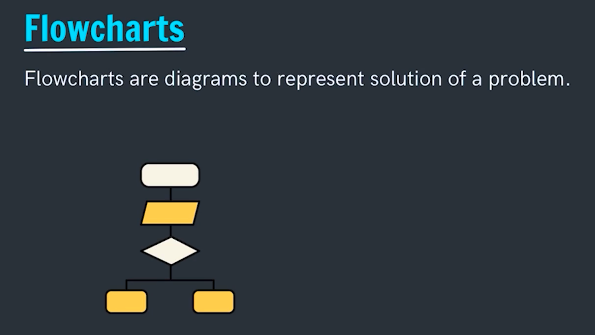
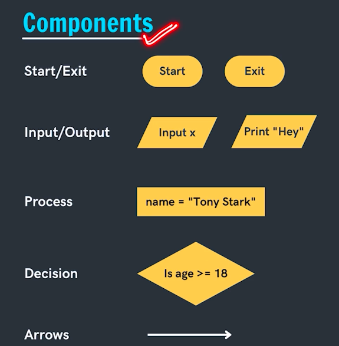

# FlowCharts

## What are flowcharts?

## Why need flowcharts?

Think if we have a problem to solve we need to:

1. break the problem into small parts
2. logically arrange the steps

## Components of a flowchart

