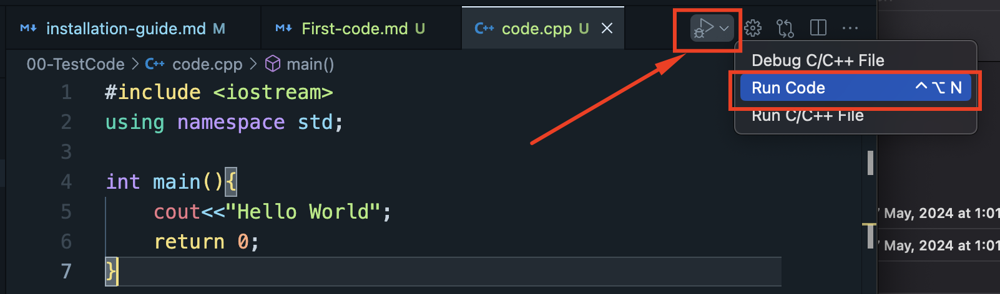
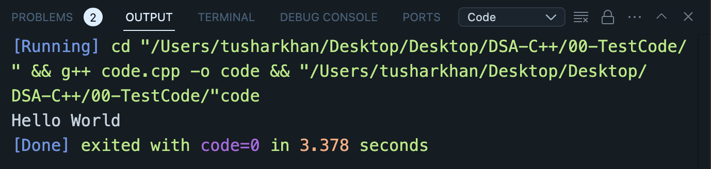

-  File extension is `.cpp`
-  We created a file named `code.cpp`
-  To print/ run our first code saying "Hello World"

Code:

```c++
#include <iostream>
using namespace std;

int main(){
    cout<<"Hello World";
    return 0;
}
```

How to Run:



Output:


